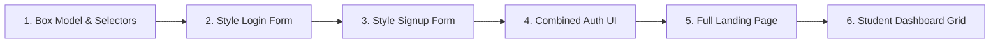

# 🎨 CSS Mastery & Responsive Design — High Q Solid Academy

<div align="center">

# High Q Solid Academy
### *Web Development Track 03 &bull; CSS Mastery & Responsive Design*
**"Always Ahead of Others"**

[](https://github.com/High-Q-Solid-Academy/course-css-mastery)
[](https://highqsolidacademy.com)
[](https://highqsolidacademy.com)

</div>

---

## 📖 Theoretical Foundations (Extracted from Academic CSS Standards)

### 1. The Cascade & Specificity Formula
Cascading Style Sheets (CSS) governs how browsers paint elements to the viewport. When multiple conflicting rules target the same DOM node, the browser calculates **Specificity** using a 4-tier tuple:

$$\text{Specificity} = (a, b, c, d)$$

| Weight | Target Type | Example |
| :---: | :--- | :--- |
| **$a$** | Inline styles | `style="color: red;"` |
| **$b$** | ID Selectors | `#login-card`, `#dashboard` |
| **$c$** | Class, Attribute, Pseudo-class Selectors | `.btn-primary`, `[type="email"]`, `:hover` |
| **$d$** | Element Types & Pseudo-elements | `div`, `p`, `::before`, `::after` |

```mermaid
graph TD
    A[Conflict: Multiple CSS Rules] --> B[Step 1: Check Importance & Origin]
    B --> C[Step 2: Compare Specificity (a, b, c, d)]
    C --> D[Step 3: Order of Appearance in Stylesheet]
    D --> WINNER[Winning Rule Painted to Screen]
```

### 2. The Box Model: Standard vs. Border-Box
Under the W3C default (`content-box`), adding padding or borders expands the element beyond its specified width:
$$\text{Rendered Width} = \text{width} + \text{padding-left} + \text{padding-right} + \text{border-left} + \text{border-right}$$

In modern production systems, we enforce the **universal border-box reset**:
```css
*, *::before, *::after {
  box-sizing: border-box;
}
```
$$\text{Rendered Width} = \text{width (Padding & Border absorbed inside)}$$

### 3. Formatting Contexts: Flexbox vs. CSS Grid
- **Flexbox (1D Layout)**: Operates along a **Main Axis** (`flex-direction: row | column`) and a **Cross Axis**. Ideal for navigation bars, form rows, button groups, and vertical centering.
- **CSS Grid (2D Layout)**: Operates simultaneously along **Rows and Columns**. Ideal for complete page architectures, card galleries, and complex dashboards.

---

## 🚀 The High Q Progressive Styling Progression

In this track, you style each building block of the **High Q Solid Academy Web App**:



---

## 📚 Styling Modules & Visual Previews

### Module 1: Core Selectors & Design Variables
- Establishing the High Q Academy design tokens on `:root`:
```css
:root {
  --hq-yellow: #f5b904;
  --hq-dark: #0b1a2c;
  --hq-slate: #1e293b;
  --hq-light-bg: #f8fafc;
  --hq-radius: 12px;
  --hq-shadow: 0 10px 30px rgba(11, 26, 44, 0.08);
}
```

### Module 2: Styling the Login Form
- Card centering using Flexbox (`display: flex; min-height: 100vh; align-items: center; justify-content: center;`).
- Clean input focus states with glowing rings (`outline: none; border-color: var(--hq-yellow); box-shadow: 0 0 0 4px rgba(245, 185, 4, 0.2);`).
- High Q branded primary CTA button with hover elevation.

### Module 3: Styling the Signup Form
- Responsive 2-column layout using CSS Grid (`grid-template-columns: 1fr 1fr; gap: 16px;`) collapsing to a single column on mobile screens.

### Module 4: The Combined Login / Signup Interface
- Styling tab toggles (`.tab-btn.active` with bottom border in `--hq-yellow`).
- Smooth transition states between Login and Signup panels.

### Module 5: Styling the High Q Landing Page
- **Hero Section**: Dark navy background (`#0b1a2c`), bold yellow typography, and floating NYSC accreditation badge.
- **Auto-Responsive Courses Grid**:
```css
.courses-grid {
  display: grid;
  grid-template-columns: repeat(auto-fit, minmax(280px, 1fr));
  gap: 24px;
}
```
- **Responsive Navigation**: Desktop inline links vs mobile drawer menu.

### Module 6: Styling the High Q Student Dashboard
- 2-column app shell with CSS Grid:
```css
.dashboard-layout {
  display: grid;
  grid-template-columns: 260px 1fr;
  min-height: 100vh;
}
```
- Metric cards, progress bars with smooth fill transitions, and responsive tables.

---

## 🛠️ Automated Testing & Layout Verification

The automated test suite in `tests/css.test.js` inspects your stylesheets to verify:
- Universal `box-sizing: border-box` reset.
- Appropriate usage of CSS Variables on `:root`.
- Correct Flexbox and CSS Grid layout rules.
- Mobile-first `@media (min-width: 768px)` breakpoints.

```bash
# Run the CSS test suite locally:
npm test
```

---

<div align="center">
  <sub>© 2026 High Q Solid Academy Limited &bull; <a href="https://highqsolidacademy.com">highqsolidacademy.com</a> &bull; "Always Ahead of Others"</sub>
</div>
