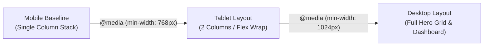

# Exercise 4: Mobile-First Responsive Landing Page & Design Tokens

<div align="center">

### High Q Solid Academy &bull; CSS Mastery Lab 04 (Capstone)
**"Always Ahead of Others"**

</div>

---

## 📖 Theoretical Foundations: Design Tokens & Mobile-First Cascading

*Reference: HTML & CSS: The Complete Reference, Fifth Edition by Thomas A. Powell*

### 1. CSS Custom Properties (Design Tokens) on `:root`
CSS Variables allow engineering teams to declare unified design tokens that cascade through the entire DOM tree:
- Declaring tokens on the pseudo-class `:root` maps them to the root `<html>` element, making them globally accessible.
- Syntax:
  ```css
  :root {
    --hq-yellow: #f5b904;
    --hq-dark: #0b1a2c;
    --hq-text: #1e293b;
    --hq-bg: #f8fafc;
  }
  ```
- Any component can consume them via `var(--token-name)`. If High Q updates its brand gold color in the future, changing the single value on `:root` updates every component instantly.

### 2. The Mobile-First Engineering Paradigm
Rather than designing desktop pages and subsequently hiding or squishing elements for mobile screens with `max-width` queries (Graceful Degradation), modern frontend engineering enforces **Mobile-First Progressive Enhancement**:
1. Base CSS defines the linear, single-column layout for small mobile screens.
2. `@media (min-width: 768px)` introduces tablet and desktop enhancements (e.g. converting a vertical stack into a multi-column flex row).
3. Benefits: Faster mobile performance, cleaner CSS overrides, and better mobile UX.



### 3. Accessible Form Styling
In High Q's 25-step methodology:
- Form fields must provide distinct `:focus-visible` outlines for keyboard navigability.
- Submit buttons should utilize `cursor: pointer`, bold typography, and smooth transitions on `:hover` and `:active`.

---

## 📋 Hands-On Lab Instructions

Inside `exercises/exercise-4-responsive-landing/style.css`:
1. Define official High Q design tokens on `:root`:
   ```css
   :root {
     --hq-yellow: #f5b904;
     --hq-dark: #0b1a2c;
     --hq-text: #1e293b;
     --hq-bg: #f8fafc;
   }
   ```
2. Set up base mobile-first styles:
   - Body font family, background `var(--hq-bg)`, text color `var(--hq-text)`.
   - Default `.hero-content` displayed as a single-column block.
3. Add a desktop breakpoint:
   ```css
   @media (min-width: 768px) {
     .hero-content {
       display: flex;
       align-items: center;
       justify-content: space-between;
     }
   }
   ```
4. Style the High Q primary CTA button (`.btn-primary`):
   - Background: `var(--hq-yellow)`
   - Text color: `var(--hq-dark)`
   - Font weight: 600
   - Padding: 12px 24px
   - Border radius: 8px
   - Border: none
   - Transition: `filter 0.2s ease`
   - Hover state: `filter: brightness(0.95)`

---

## 🧪 Verification
Verify your implementation with:
```bash
npm.cmd test -- -t "Exercise 4"
```

---

<div align="center">
  <sub>High Q Solid Academy &bull; <a href="https://highqsolidacademy.com">highqsolidacademy.com</a></sub>
</div>
